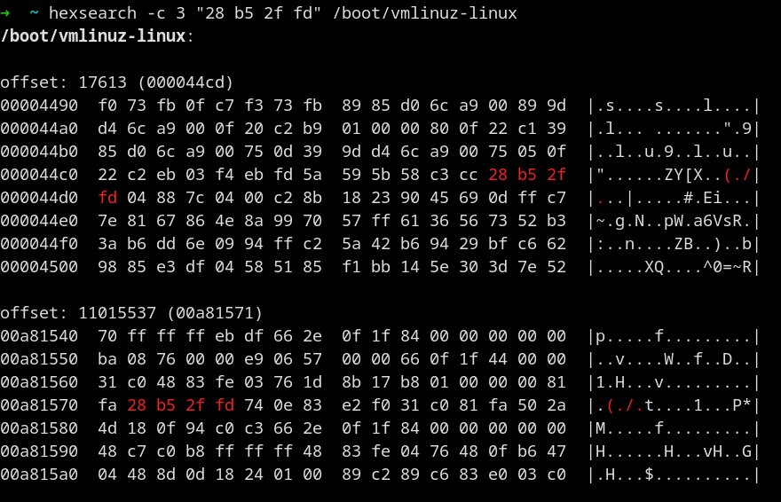

# hexsearch

A CLI utility to search arbitrary bytes in files, by leveraging the power of [regex](https://github.com/rust-lang/regex#usage-match-regular-expressions-on-u8) crate in Rust.



# Install

The following command will install `hexsearch` executable in `~/.cargo/bin` directory:

```
cargo install --path .
```

# Usage

```
hexsearch [OPTIONS] <bytes> <file>
```

The bytes to be searched can be in one of two formats:

* individual bytes in hexadecimal separated by space: `1f 8b 08`
* hexadecimal value in one word prefixed with 0x: `0x1f8b08`. This format will respect the `--endian` argument and it's big-endian by default

The search result will be printed in a style similar to [hexdump(1)](https://www.man7.org/linux/man-pages/man1/hexdump.1.html) and you can set the line width by `--width` argument (default width: 16).

You can also print some extra lines before and after the search result by setting `--context` argument.

See `hexsearch --help` for full usage.

# License

This project is licensed under [MIT license](LICENSE).
